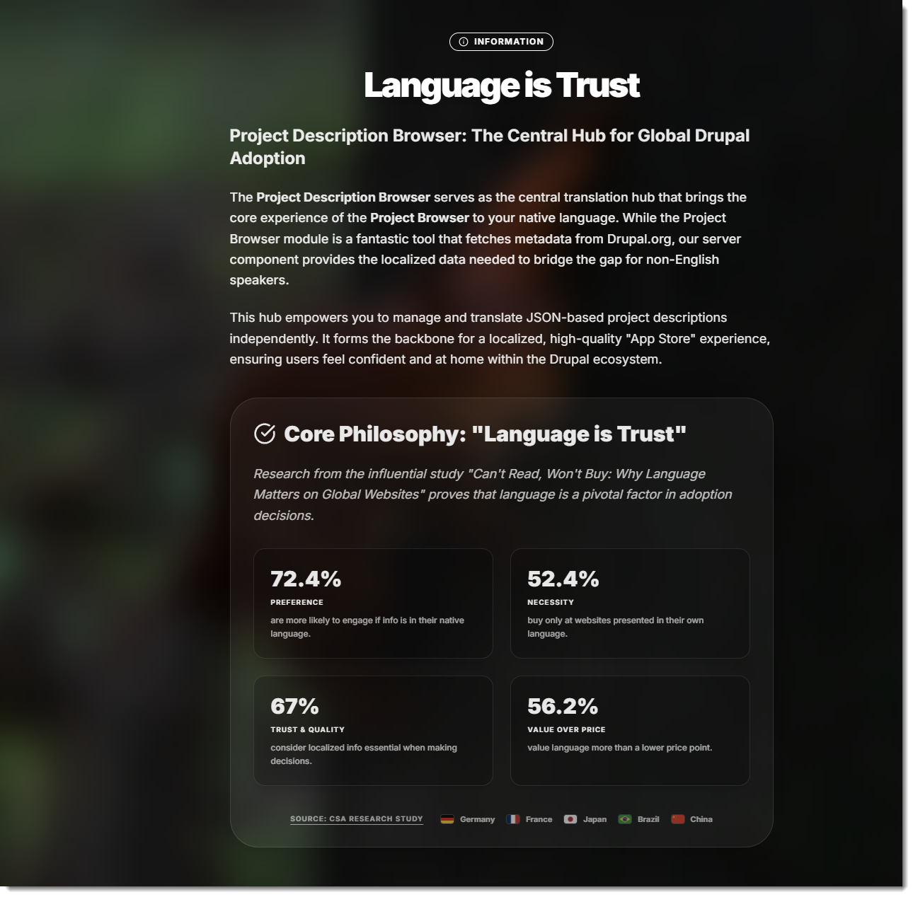
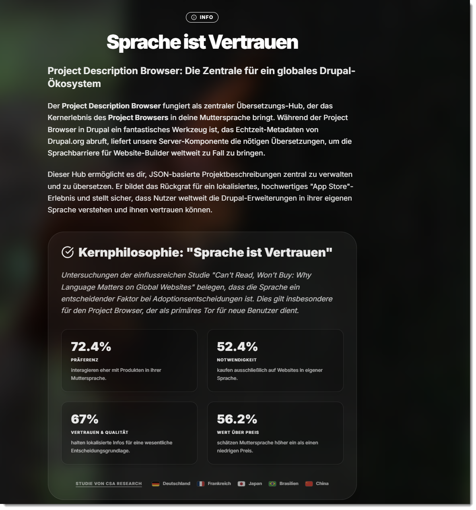

# Project Browser Translation Hub

[](https://drupal.org)
[](https://nodejs.org)
[](https://mariadb.org)
[](https://reactjs.org)

> **EN:** A specialized middleware and editor for translating the Drupal Project Browser ecosystem.
> 
> **DE:** Ein spezialisiertes Middleware- und Editor-Tool zur Übersetzung des Drupal Project Browser Ökosystems.

---

## 🇺🇸 English



### What is this?
The **Project Description Browser** is the central server hub designed to bridge the language gap in the Drupal ecosystem. While the Drupal Project Browser allows users to discover modules directly within their site, much of the data remains in English. This Hub acts as a translation server that provides localized data to the **Project Browser Localizer** Drupal module. 

Built on the philosophy of **"Language is Trust"** (backed by CSA Research showing 72% of users prefer native-language interfaces), this Hub syncs data from Drupal.org, allows translators to provide localized content via a high-end editor, and serves it as a "Shadow API".

### Key Features
- **Central Translation Hub:** Serves localized JSON data to the Project Browser Localizer module.
- **Shadow API:** Intercepts live data and overlays it with local translations.
- **Stale Detection:** Automatically detects when the original English source on Drupal.org has changed.
- **Privacy-First Design:** Includes a 100% GDPR-compliant help center with a consent-based YouTube widget (no automatic tracking).
- **Stunning UI:** Modern "Acrylic/Glassy" design with dynamic Unsplash backgrounds.
- **Productivity First:** Full keyboard shortcut support and AI-assisted prompts for LLMs (Gemini/ChatGPT).

### 🐳 Docker Deployment (Recommended)
The easiest and most performant way to run the PB Translation Hub is via **Docker & Docker Compose**. It solves dependency issues and automatically uses all CPU cores for maximum performance.

#### Step 1: Install Docker on Ubuntu (For Beginners)
If Docker is not yet installed on your Ubuntu server, run these commands:
```bash
# Remove old versions (if any)
sudo apt-get remove docker docker-engine docker.io containerd runc

# Update package lists
sudo apt-get update

# Install Docker & Docker Compose
sudo apt-get install -y docker.io docker-compose-plugin

# Add your user to the docker group (to avoid typing 'sudo' every time)
sudo usermod -aG docker $USER
# Important: Log out and log back in for this to take effect!
```

#### Step 2: Start the App
Navigate to the app directory and start everything:
```bash
cd /var/www/drupalcms/pb_translation_hub
docker compose up -d --build
```
That's it! The app is now accessible at `http://localhost:5173` (or your server IP on port 5173).

#### 💾 How do Docker "Volumes" work?
A Docker container is naturally "ephemeral" – if the container is deleted, all modified files inside are lost. To ensure our database and translations are not lost, we use **Volumes** in `docker-compose.yml`.

- **Database Volume (`db_data:/var/lib/mysql`):** Docker creates an internal, secure storage area on your Ubuntu system. All MariaDB database entries land in this persistent volume. Whether you stop, update, or delete the container – your database remains safe forever.
- **File Volume (`./server/data:/app/data`):** We use a "Bind Mount" here. We link the regular folder `server/data` (in this project directory) to the path `/app/data` inside the running Node.js container. *Why?* The Hub additionally saves all translations as `.json` files. Because we "bind" this folder directly to your server, you can view, copy, SCP, or commit these JSON backups to Git normally using Ubuntu.

#### ⚙️ Changing Ports
If port 5173 is already in use on your server, simply open `docker-compose.yml` with an editor (e.g., `nano docker-compose.yml`) and change the entry under `client`:
```yaml
  client:
    ports:
      - "8080:80"  # Change 5173 to 8080 or any free port
```
Then run `docker compose up -d` again to apply the change without data loss.

### 🛠️ Manual Commands (Without Docker)

| Action | Command |
| :--- | :--- |
| **Start** | `./hubctl.sh start` |
| **Stop** | `./hubctl.sh stop` |
| **Restart** | `./hubctl.sh restart` |
| **Status** | `./hubctl.sh status` |
| **Build Frontend** | `cd client && npm run build` |
| **Install Dependencies** | `npm install` (in `client` & `server`) |

---

## 🇩🇪 Deutsch



### Was ist das?
Der **Project Description Browser** ist der zentrale Übersetzungs-Hub, der die Sprachbarriere im Drupal-Ökosystem überbrückt. Er liefert die lokalisierten Daten für das Drupal-Modul **Project Browser Localizer**. 

Basierend auf der Philosophie **"Sprache ist Vertrauen"** (gestützt durch eine CSA-Studie, die zeigt, dass 72% der Nutzer Interfaces in ihrer Muttersprache bevorzugen), synchronisiert dieser Hub Daten von Drupal.org, ermöglicht deren Übersetzung in einem Premium-Editor und stellt sie als "Shadow API" bereit.

### Hauptfunktionen
- **Zentraler Übersetzungs-Hub:** Liefert lokalisierte JSON-Daten an das Project Browser Localizer Modul.
- **Shadow API:** Fängt Live-Daten ab und überlagert sie mit lokalen Übersetzungen.
- **Stale Detection:** Erkennt automatisch, wenn sich die englische Originalquelle auf Drupal.org geändert hat.
- **100% Datenschutzkonform:** Beinhaltet ein DSGVO-konformes Hilfe-Center mit Consent-basiertem YouTube-Widget (kein Tracking ohne Zustimmung).
- **Premium Design:** Modernes "Acrylic/Glassmorphism"-Design mit dynamischen Unsplash-Hintergründen.
- **Produktivität:** Volle Unterstützung für Tastaturkürzel und KI-gestützte Prompts für LLMs (Gemini/ChatGPT).

### 🐳 Docker Deployment (Empfohlen)
Die einfachste und performanteste Methode, um den PB Translation Hub zu betreiben, ist über **Docker & Docker Compose**. Das löst Abhängigkeitsprobleme und nutzt automatisch alle CPU-Kerne für höchste Leistung.

#### Schritt 1: Docker unter Ubuntu installieren (für Anfänger)
Wenn Docker noch nicht auf Ihrem Ubuntu-Server installiert ist, führen Sie diese Befehle im Terminal aus:
```bash
# Alte Versionen entfernen (falls vorhanden)
sudo apt-get remove docker docker-engine docker.io containerd runc

# Paketquellen aktualisieren
sudo apt-get update

# Docker & Docker Compose installieren
sudo apt-get install -y docker.io docker-compose-plugin

# Den eigenen Nutzer zur Docker-Gruppe hinzufügen (damit man nicht immer 'sudo' tippen muss)
sudo usermod -aG docker $USER
# Wichtig: Danach einmal abmelden und wieder anmelden!
```

#### Schritt 2: App starten
Wechseln Sie in das Verzeichnis der App und starten Sie alles:
```bash
cd /var/www/drupalcms/pb_translation_hub
docker compose up -d --build
```
Das war's! Die App ist jetzt unter `http://localhost:5173` (bzw. Ihrer Server-IP auf Port 5173) erreichbar.

#### 💾 Wie funktionieren die "Volumes" in Docker?
Ein Docker-Container ist von Natur aus "flüchtig" – wenn der Container gelöscht wird, sind alle darin geänderten Dateien weg. Damit unsere Datenbank und unsere Übersetzungen nicht verloren gehen, nutzen wir in der `docker-compose.yml` sogenannte **Volumes** (virtuelle Laufwerke).

- **Datenbank-Volume (`db_data:/var/lib/mysql`):** Docker erstellt hierbei einen internen, sicheren Speicherbereich (`db_data`) auf Ihrem Ubuntu-System. Alle MariaDB-Datenbank-Einträge landen in diesem persistenten Docker-Volume. Egal ob Sie den Container stoppen, updaten oder löschen – Ihre Datenbank bleibt sicher erhalten.
- **Datei-Volume (`./server/data:/app/data`):** Hier nutzen wir ein sogenanntes "Bind Mount". Das bedeutet, wir verknüpfen den ganz normalen Ordner `server/data` (der sich in diesem Projekt-Verzeichnis befindet) mit dem Pfad `/app/data` innerhalb des laufenden Node.js-Containers. *Warum machen wir das so?* Der Hub speichert zur Sicherheit alle Übersetzungen zusätzlich als `.json`-Dateien ab. Da wir diesen Ordner direkt nach außen auf den Server "binden" (durchschleifen), können Sie die JSON-Backups jederzeit ganz normal im Ubuntu-Dateimanager ansehen, kopieren, per SCP herunterladen oder in Git einchecken. 

#### ⚙️ Ports ändern
Falls der Port 5173 auf Ihrem Server bereits belegt ist, öffnen Sie einfach die Datei `docker-compose.yml` mit einem Editor (z.B. `nano docker-compose.yml`) und ändern ganz unten den Eintrag unter `client`:
```yaml
  client:
    ports:
      - "8080:80"  # Ändern Sie 5173 zu 8080 oder jedem beliebigen freien Port
```
Anschließend einfach wieder `docker compose up -d` ausführen, um die Änderung ohne Datenverlust anzuwenden.

### 🛠️ Manuelle Commands / Befehle (ohne Docker)

| Action | Command |
| :--- | :--- |
| **Start** | `./hubctl.sh start` |
| **Stop** | `./hubctl.sh stop` |
| **Restart** | `./hubctl.sh restart` |
| **Status** | `./hubctl.sh status` |
| **Build Frontend** | `cd client && npm run build` |
| **Install Dependencies** | `npm install` (in `client` & `server`) |

---

For more details, see [DOCUMENTATION.md](./DOCUMENTATION.md), [DATABASE.md](./DATABASE.md) and [AGENTS.md](./AGENTS.md).
